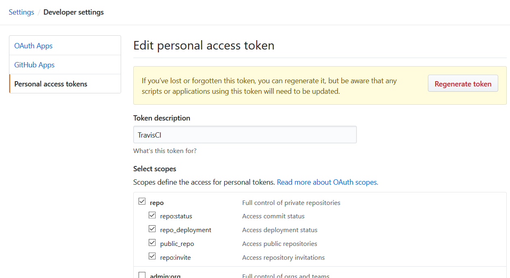
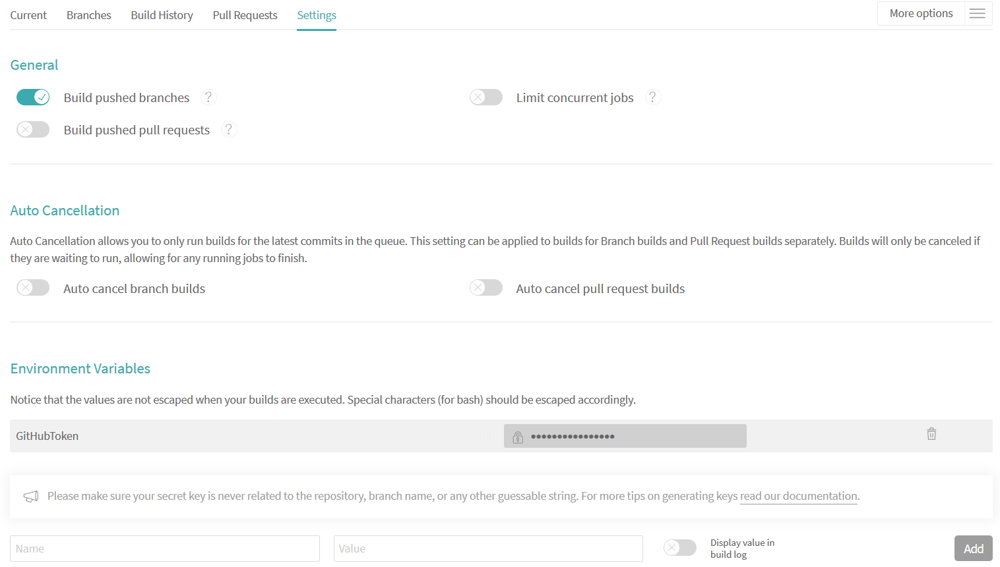
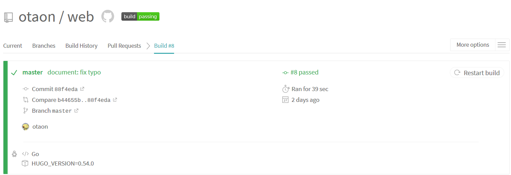
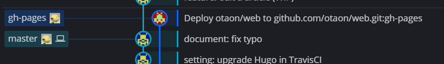

# はじめに
自前でサーバを構築することなく、全て外部サービスを使用してブログ的な静的サイトを楽に作りたい場合、この記事が役に立つと思う。  
このWebサイトも、この記事と全く同じ方法で作成している。  

`html`, `css`諸々を書いて、サーバを立てて、ドメインを取って…という事を全くせずにWebサイトが構築できる。

<!--more-->

----

# 前提条件
- GitHub、および、Gitの基本的な使い方が分かる。
- Markdown記法、および、極初歩的な`html`, `css`が扱える。
- CIツールを使用したことがある。TravisCIの使用経験は問わない。

# 事前に知っておくべきこと
## GitHub Pagesとは
[GitHub Pages](https://pages.github.com/) とは、GitHubによる静的サイトのホスティングサービス。  
GitHubアカウントがあれば、誰でも独自のWebサイトが構築できる。  
デフォルトでは`<アカウント名>.github.io`にページを公開できる。

## Hugoとは
[Hugo](https://gohugo.io/)とは、Go言語で書かれた、比較的新しい静的サイトジェネレータ。  
これを使うと、Markdown記法で記事を書くだけで、`html`, `css`ファイルを生成できる。

## TravisCIとは
TravisCIとは、ドイツのTravis CI社によって運営されている継続的インテグレーション(CI)サービス。  
オープンソースプロジェクトなら`travis-ci.org`で無料で、プライベートプロジェクトであれば`travis-ci.com`で有料で利用できる。  
ただし、GitHubアカウントでログインする場合は、無料だが`travis-ci.com`での利用になるらしい(実経験に基づく)。


----

# どうやってHugoで記事編集・デプロイするのか?
この記事のとおりにサービスの設定を行えば、下記の手順で記事を編集し、デプロイできるようになる。  

## 記事を編集する
1. 記事を編集する。
1. 端末(cmd, power shell, bash, ...)で`hugo server`を実行する。
1. hugoが、`localhost:1313/web`(本記事の設定の場合)でサイトをサーブする。

この手順を繰り返すことで、ローカル環境でもブラウザから記事の様子を確認しながら記事を編集できる。

また、`hugo server`を実行し続けながら記事を編集すると、大体の場合でhugoが自動的にサーブ内容を更新してくれる。
これによって、記事の変更をリアルタイムに確認できる。


## 記事をデプロイする
記事をGitHub Pagesにデプロイするのは手動でも可能だ。  
しかし、TravisCIを使えば、記事をGitHubにpushするだけで自動的にGitHub Pagesにデプロイまで実行される(下記手順参照)。

1. GitHubリポジトリに記事用のブランチを作成して、記事をpushする。
1. ブランチを`master`にマージすると、GitHubがTravisCIにマージを通知する。
1. TravisCIが、記事の自動ビルドとデプロイを開始する。
1. TravisCIが、`gh-page`ブランチ(orphanブランチ)にhtmlファイルをpushする。
1. GitHubが、GitHub Pagesにhtmlファイルをデプロイする。
1. GitHub Pagesが、デプロイされたファイル一式をサーブする。


----

# サイト&編集環境の構築手順
ほとんどの手順で下記サイトを参考にした。ありがとうございます。  
大体は下記サイトを参照すれば良いが、詳細部分の備忘録、また一部構成を変えた部分の補足を目的として下記に全手順を残す。  
[ぽよメモ - Hugo + Travis CI + Github pagesで独自ドメイン+HTTPSなWebページを公開する](https://poyo.hatenablog.jp/entry/2018/06/08/145255)

記事編集・デプロイを可能にするためには、まずサイトを構築する必要がある。  
といっても、サイトはGitHub Pagesがホスティングしてくれるし、ファイルのデプロイ自体もGitHubの`gh-pages`ブランチに格納するだけだ。  
つまり下記のみを実施すれば良い。

1. Webサイトの記事を置くリポジトリを作成する
1. Hugoを用いたサイトのプレビュー環境の構築
1. Hugoによるビルド&`gh-pages`ブランチへのpushの自動化設定

## 1. Webサイトの記事を置くリポジトリを作成する
作成するリポジトリ名は`<ユーザ名>.github.io`とそれ以外の2種類ある。それぞれの特徴を下記に示す。

- リポジトリ名を`<ユーザ名>.github.io`にする
  - 公開されるURL: `https://<ユーザ名>.github.io`
  - 公開対象のコンテンツ: `master`ブランチの内容
- リポジトリ名をそれ以外(本サイトでは`web`)にする
  - 公開されるURL: `https://<ユーザ名>.github.io/<リポジトリ名>`
  - 公開対象のコンテンツ: `gh-pages`ブランチ(orphanブランチ)の内容

ここではCIを使用する都合上、後者を選択する。[^なぜ後者?]  
本サイトではリポジトリ名を`web`としたが、他のリポジトリ名でも適宜読み替えれば問題無い。

ここからの設定は全て`master`ブランチ上で実施する。

[^なぜ後者?]:前者の場合、ユーザが`master`に記事をpushした場合、前者のリポジトリ名だと、CIはビルドした成果物を`master`にpushすることになる。こうなると、ユーザが編集していないのに勝手に`master`の`head`が進むし、何より`master`の内容が公開されてしまうので、Hugoに食わせる「素」のデータも無駄に公開することになってしまい汚い(どこかでエントリポイントの変更ができるのかもしれないが・・・)。

では、GitHubで`web`リポジトリを作成し、ローカルにcloneする。

## 2. Hugoを用いたサイトのプレビュー環境の構築
### 2-1. Hugoをインストールする
Hugoはマルチプラットフォーム対応しており、Windows, Mac, Linuxで使用できる。  
Windowsの場合は[公式ドキュメント](https://gohugo.io/getting-started/installing/#chocolatey-windows)のとおり、chocolateyを使用してHugoをインストールする。

```cmd
> choco install hugo -confirm
```

### 2-2. Hugoでサイトの初期設定を行う
`web`リポジトリのワークツリーに移動して、Hugoでサイトの雛形を生成する。  
本サイトでは、コマンド末尾の引数(サイトの全データが入るディレクトリ名)をリポジトリ名と同じにしてしまったが、ややこしいかもしれない。

```cmd
> hugo new site web
```

上記を実行すると`web/` の下に更に`web`フォルダが作成され、その中にHugo用のファイルやフォルダがごそっと作成されている。  
これでHugoが最低限使用できる状態となったため、一旦コミットしておくと良い。

### 2-3. Hugoのテーマを作るor公式サイトで選ぶ
Hugoの公式サイトに、様々なテーマが公開されている。ここから自分の気に入った&目的に見合ったテーマを選ぶ。テーマを自作しても良いが、おそらくかなりの手間になるのでやめてしまった。  
スマートフォンなどからも見やすい方が良いと思うので、下記のレスポンシブデザインから選ぶと後で困らない(と思う)。  

[Hugo Themes (Tag: Responsive)](https://themes.gohugo.io/tags/responsive/)

ちなみに本サイトでは[Den](https://themes.gohugo.io/hugo-theme-den/)を使用している。サッパリしていて使いやすい。ライセンスがGPLv2だが、そもそも本サイトがサーブするのはGitHubに公開したデータなのだから、あまり気にしなくて良いかと考えた(考えるのをやめた)。

### 2-4. Hugoのテーマをワークツリーに格納する
テーマを選択したら、テーマのzipをダウンロードして、`web/web/themes/`の下に格納する。submoduleとして取り込むのはおすすめしない。[^理由]  
本サイトの場合、`web/web/themes/hugo-theme-den`というディレクトリ構成となった。

[^理由]:submoduleとして取り込むのはよく考えてからの方が良い。当初はGitHubのリポジトリをsubmoduleとして取り込んだが、これは失敗だった。Denの多言語化設定に日本語用の設定ファイルが入っていなかったため、結局自分で日本語用の設定ファイルを書くことになった。その結果submoduleに変更が入ってしまいsubmoduleとの同期がずれた・・・。日本語用の設定ファイルを正しくPRしても良かったが、正しい翻訳になっているのか未検証なので、とりあえず自分の環境だけで様子見とした。おそらく最も良い方法は、Denをforkして、それをsubmoduleとして取り込む方法だろう。こうすればsubmoduleとして分割したまま編集できるし、気が向いたらPRを送ることもできる。

### 2-5. Hugoのテーマが使用可能か確認する
ここで、ダウンロードしたテーマが本当に利用可能なのかを確かめてみた方が良い。  
Denの場合は`hugo-theme-den/exampleSite`フォルダにサンプルサイトのデータ一式が入っていたので、これを`web/web/*`にコピーした。
`web/web/*`には手順2-2によって`content/`や`config.toml`といったフォルダ&ファイルが作成されていると思うが、これらに上書きしてしまえば良い。失敗したら巻き戻せるのもgitの強み。

サンプルサイト用のデータをコピーしたら、下記コマンドを実行する。

```cmd
hugo server
```

エラーらしきメッセージが出ていなかったら成功してサーブ状態になっているはず。  
`localhost:1313`にアクセスしてサンプルページが表示されれば、Hugoがビルド可能&テーマがバグってない事が分かる。  
(まだ設定ファイルを修正していないため`localhost:1313/web`でのサーブではないことに注意。)

### 2-6. Hugoの設定ファイル`config.toml`を自分用に修正する
上記までの手順を実施したら`web/web/`の下に`config.toml`が存在していると思う。これはサンプルのテーマからコピーしたものなので、自分の環境に合わせて編集する必要がある。設定を全て説明するのは面倒なので、一部抜粋して記載する。

```toml
# ------------------------------------- #
# ---- General Settings --------------- #
# ------------------------------------- #
baseURL = "https://otaon.github.io/web" # Webサイトのエントリポイントを設定する
title = "Lazy Lambda" # Webサイト名を設定する
theme = "hugo-theme-den" # テーマ名を設定する(サンプルテーマなら、そのテーマのサンプル設定ファイルを参照)
#enableRobotsTXT = true       # generate robots.txt
enableEmoji = true           # use emoji support
hasCJKLanguage = true        # detect CJK languages for word count etc.(日本語を使用するならtrue)
preserveTaxonomyNames = true # do not make tag names lowercase
# uglyURLs = true            # more info: https://gohugo.io/content-management/urls/#ugly-urls(末尾がファイル名のURLを許可するか)
rssLimit = 20                # limit number of entries in RSS feeds

# Copyright, appears in the footer
# copyright = ""             # default: author.name

# Pagination
# number of entries per page for archives, tags and categories
# since we don't have list view, recommend a large value
paginate = 20
paginatePath = "page"

# Syntax Hightlight
PygmentsCodeFences = true
PygmentsUseClasses = true    # required for shhighlight shortcode

# service plugins
disqusShortname = ""         # disqus_shortname
googleAnalytics = ""         # UA-XXXXXXXX-X

# language support # en / zh-tw / other... translations present in i18n/
defaultContentLanguage = "ja-jp"           # Default language to use
defaultContentLanguageInSubdir = true

###### snipped ######
```

実際の設定ファイルは下記参照。  
[GitHub - web/web/config.toml](https://github.com/otaon/web/blob/how-to-make-web-page-with-hugo/web/config.toml)

### 2-7. 日本語用の多言語対応ファイルを作成する
選択したテーマにもよるが、Denの場合は言語ファイルを作れば複数言語の記事公開が可能だ。  
テーマによって設定が違うかもしれないが、作成した言語ファイルはテーマのフォルダ内に格納すれば良いと思う。  
本サイトの場合、日本語用の言語ファイルを作成して下記に格納した。  
[web/web/themes/hugo-theme-den/i18n/ja-jp.yaml](https://github.com/otaon/web/blob/how-to-make-web-page-with-hugo/web/themes/hugo-theme-den/i18n/ja-jp.yaml)

### 2-8. サイトのコンテンツを自分向けに変更する
ここまでの設定で、自分用のサイトをビルドできる状態になった。しかし、コンテンツ自体はまだサンプルのままなので修正する。とりあえず、下記ファイルを修正しておけば良いと思う。

- 著者情報
  - サイト管理者の情報を記載する。
  - [web/web/data/authors/otaon.toml](https://github.com/otaon/web/blob/how-to-make-web-page-with-hugo/web/data/authors/otaon.toml)
- 画像ファイル
  - サイト全般で使用する画像を格納する。記事内だけに使用する画像は、ここではなく記事のフォルダ内に入れる。
  - [web/web/static/images/](https://github.com/otaon/web/tree/how-to-make-web-page-with-hugo/web/static/images)
- 記事
  - このフォルダに記事を格納する。
  - 言語別にフォルダが分かれている。
  - 画像ファイルを使用した記事を書くなら、記事ごとにフォルダを作成して、その中にファイルを格納する。
  - 単一のmarkdownファイルで完結する記事の場合は、フォルダ分けする必要はない。
  - [web/web/content/](https://github.com/otaon/web/tree/how-to-make-web-page-with-hugo/web/content)

### 2-9. `.gitignore`を作成する
ビルドした結果をコミットしないように`.gitignore`を作成する。

```sh
# Binaries for programs and plugins
*.exe
*.exe~
*.dll
*.so
*.dylib

# Test binary, build with `go test -c`
*.test

# Output of the go coverage tool, specifically when used with LiteIDE
*.out

# ignore public directory deploied by Hugo
web/public/*
```

### 2-10. ファイルをコミットする
ここまでに編集したファイルをコミットする。これで`hugo server`を実行しながら記事を記述する環境が整った。

## 3. Hugoによるビルド&gh-pagesへのpushの自動化設定
Hugoによってビルドした成果物をGitHubに格納するのを自動化するために、TravisCIを使用する。  
ここでは、TravisCIを初めて使用する場合の設定方法も含めて説明する。

### 3-1. TravisCIにサインアップする
https://travis-ci.com/ にアクセスして、GitHubのアカウントでサインアップする。  

### 3-2. GitHubでTravisCIが使うためのトークンを作成する
https://github.com/settings/tokens で、TravisCI用のトークンを作成する。scopeは画像のとおり、repoのみで良い。[^トークン] 
作成したトークンをコピーしておくこと。

[^トークン]:本当ならリポジトリ固有のトークンを作成した方がリスク低減できるが、リポジトリのアクセス程度なら最悪の場合でも泣くだけなので目を瞑った。  



### 3-3. TravisCIの`web`リポジトリの設定をする
TravisCIの`web`リポジトリのsettingページで自動ビルド用の設定を行う。

まず、「General」設定で、Build pushed branchesをチェックする。これでブランチに何らかがpushされたときにTravisCIが自動的にビルドしてくれる。  
次に、「Environment Variables」設定で、先程コピーしておいたGitHubのトークンを登録する。ここでは`GitHubToken`という環境変数名にした。[^環境変数]  
[^環境変数]:TravisCIでは、環境設定に追加した文字列が誤ってビルドログに出力されてしまっても、それを隠してくれる。トークン流出防止のためには、必ず環境変数を使用すること。



### 3-4. TravisCIのビルド設定ファイル`.travis.yml`を作成する
TravisCIは、リポジトリのトップディレクトリの`.travis.yml`ファイルに書かれたビルドレシピを実行する。  
したがって`web/.travis.yml`に、Hugoによるビルドと、ビルド成果物の`gh-pages`ブランチへの`push`を実施するように記載することで、ビルドとデプロイを自動化できる。

実際の設定ファイルは下記のとおり。本サイトの場合はこれでビルド&デプロイできた。  
[web/.travis.yml](https://github.com/otaon/web/blob/master/.travis.yml)

念のための注意点を下記に述べる。

- `script`でhugoが実行されるとき、カレントディレクトリは`hugo server`が正常に動作するディレクトリである必要がある。  
本サイトの場合は`cd web`としてカレントディレクトリを変更しておく必要がある。
- ビルドに使用するHugoは、Hugo公式リポジトリのdepパッケージを使用している。
  - Hugoのバージョンが古いとうまく動作しないテーマもあるらしいため、うまく動作しない場合はHugoのバージョンを怪しんでみると良いかも知れない。

### 3-5. ワークツリーの内容を全て`push`する
ここまでで、ワークツリーにはHugoにビルドさせるデータと、TravisCIの設定ファイルが格納されていることになる。  
ここで、ワークツリーの内容を全て`master`ブランチにpushする。数十秒経つとTravisCIが自動ビルドとデプロイを開始する。  
下記画像のようにビルドが成功したことを確認すること。  
[本サイトのTravisCI自動ビルド結果](https://travis-ci.com/otaon/web)



### 3-6. `gh-pages`ブランチにビルド結果が`push`されていることを確認する
ビルドが成功していれば、下記のとおり`gh-pages`ブランチにビルド成果物が`push`されているはずだ。  


最後に`gh-pages`ブランチに格納されたデータがGitHub Pagesに公開されたことを確認する。  
https://otaon.github.io/web/

Webサイトが公開されていれば自動ビルド&デプロイは成功。  
今後は、下記のサイクルで記事を公開することができる。とても楽だと思う。

1. 記事毎にブランチを切る
1. ローカル環境のHugoでプレビューしながら記事を書く
1. ブランチをmasterにマージする
1. 自動ビルド&デプロイが走り、勝手に記事が公開される

# まとめ
- Hugoを使って、ローカルでプレビューしながらサイトの記事を書けるようにした
- Hugoを使って、Webサーバにデプロイするためのhtmlファイルをビルドできるようにした
- TravisCIを使って、Hugoによるビルドとhtmlファイルのデプロイを自動化できるようにした
