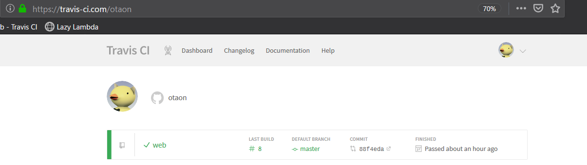

# はじめに
自前でサーバを構築することなく、全て外部サービスを使用してブログ的な静的サイトを楽に作りたい場合、この記事が役に立つと思う。  
このWebサイトも、この記事と全く同じ方法で作成している。  

`html`, `css`諸々を書いて、サーバを立てて、ドメインを取って…という事を全くせずにWebサイトが構築できる。

<!--more-->

----

# 前提条件
- GitHub、および、Gitの基本的な使い方が分かる。
- Markdown記法、および、極初歩的な`html`, `css`が扱える。
- CIツールを使用したことがある。TravisCIの使用経験は問わない。

# 事前に知っておくべきこと
## GitHub Pagesとは
[GitHub Pages](https://pages.github.com/) とは、GitHubによる静的サイトのホスティングサービス。  
GitHubアカウントがあれば、誰でも独自のWebサイトが構築できる。  
デフォルトでは`<アカウント名>.github.io`にページを公開できる。

## Hugoとは
[Hugo](https://gohugo.io/)とは、Go言語で書かれた、比較的新しい静的サイトジェネレータ。  
これを使うと、Markdown記法で記事を書くだけで、`html`, `css`ファイルを生成できる。

## TravisCIとは
TravisCIとは、ドイツのTravis CI社によって運営されている継続的インテグレーション(CI)サービス。  
オープンソースプロジェクトなら`travis-ci.org`で無料で、プライベートプロジェクトであれば`travis-ci.com`で有料で利用できる。  
ただし、GitHubアカウントでログインする場合は、無料だが`travis-ci.com`での利用になるらしい(実経験に基づく)。



----

# どうやってHugoで記事編集・デプロイするのか?
この記事のとおりにサービスの設定を行えば、下記の手順で記事を編集し、デプロイできるようになる。  

## 記事を編集する
1. 記事を編集する。
1. 端末(cmd, power shell, bash, ...)で`hugo server`を実行する。
1. hugoが、`localhost:1313/web`(本記事の設定の場合)でサイトをサーブする。

この手順を繰り返すことで、ローカル環境でもブラウザから記事の様子を確認しながら記事を編集できる。

また、`hugo server`を実行し続けながら記事を編集すると、大体の場合でhugoが自動的にサーブ内容を更新してくれる。
これによって、記事の変更をリアルタイムに確認できる。


## 記事をデプロイする
記事をGitHub Pagesにデプロイするのは手動でも可能だ。  
しかし、TravisCIを使えば、記事をGitHubにpushするだけで自動的にGitHub Pagesにデプロイまで実行される(下記手順参照)。

1. GitHubリポジトリに記事用のブランチを作成して、記事をpushする。
1. ブランチを`master`にマージすると、GitHubがTravisCIにマージを通知する。
1. TravisCIが、記事の自動ビルドとデプロイを開始する。
1. TravisCIが、`gh-page`ブランチ(orphanブランチ)にhtmlファイルをpushする。
1. GitHubが、GitHub Pagesにhtmlファイルをデプロイする。
1. GitHub Pagesが、デプロイされたファイル一式をサーブする。


----

# サイト&編集環境の構築手順
ほとんどの手順で下記サイトを参考にした。ありがとうございます。  
大体は下記サイトを参照すれば良いが、詳細部分の備忘録、また一部構成を変えた部分の補足を目的として下記に全手順を残す。  
[ぽよメモ - Hugo + Travis CI + Github pagesで独自ドメイン+HTTPSなWebページを公開する](https://poyo.hatenablog.jp/entry/2018/06/08/145255)

記事編集・デプロイを可能にするためには、まずサイトを構築する必要がある。  
といっても、サイトはGitHub Pagesがホスティングしてくれるし、ファイルのデプロイ自体もGitHubの`gh-pages`ブランチに格納するだけだ。  
つまり下記のみを実施すれば良い。

1. Webサイトの記事を置くリポジトリを作成する
1. Hugoを用いたサイトのプレビュー環境の構築
1. Hugoによるビルドの自動化設定
1. `gh-pages`へのpushの自動化設定

## 1. Webサイトの記事を置くリポジトリを作成する
作成するリポジトリ名は`<ユーザ名>.github.io`とそれ以外の2種類ある。それぞれの特徴を下記に示す。

- リポジトリ名を`<ユーザ名>.github.io`にする
  - 公開されるURL: `https://<ユーザ名>.github.io`
  - 公開対象のコンテンツ: `master`ブランチの内容
- リポジトリ名をそれ以外(本サイトでは`web`)にする
  - 公開されるURL: `https://<ユーザ名>.github.io/<リポジトリ名>`
  - 公開対象のコンテンツ: `gh-pages`ブランチ(orphanブランチ)の内容

ここではCIを使用する都合上、後者を選択する。  
また、本サイトではリポジトリ名を`web`としたが、他のリポジトリ名でも適宜読み替えれば問題無い。

**補足:なぜ後者?**  
前者の場合、ユーザが`master`に記事をpushした場合、前者のリポジトリ名だと、CIはビルドした成果物を`master`にpushすることになる。  
こうなると、ユーザが編集していないのに勝手に`master`の`head`が進むし、何より`master`の内容が公開されてしまうので、Hugoに食わせる「素」のデータも無駄に公開することになってしまう(どこかでエントリポイントの変更ができるのかもしれないが・・・)。

では、GitHubで`web`リポジトリを作成し、ローカルにcloneする。

## 2. Hugoを用いたサイトのプレビュー環境の構築
### 2-1. Hugoをインストールする
Hugoはマルチプラットフォーム対応しており、Windows, Mac, Linuxで使用できる。  
Windowsの場合は[公式ドキュメント](https://gohugo.io/getting-started/installing/#chocolatey-windows)のとおり、chocolateyを使用してHugoをインストールする。

```cmd
> choco install hugo -confirm
```

### 2-2. Hugoでサイトの初期設定を行う
`web`リポジトリのワークツリーに移動して、Hugoでサイトの雛形を生成する。  
本サイトでは、コマンド末尾の引数(サイトの全データが入るディレクトリ名)をリポジトリ名と同じにしてしまったが、ややこしいかもしれない。

```cmd
> hugo new site web
```

上記を実行すると`web/` の下に更に`web`フォルダが作成され、その中にHugo用のファイルやフォルダがごそっと作成されている。  
これでHugoが最低限使用できる状態となったため、一旦コミットしておくと良い。

### 2-3. Hugoのテーマを作るor公式サイトで選ぶ
Hugoの公式サイトに、様々なテーマが公開されている。ここから自分の気に入った&目的に見合ったテーマを選ぶ。テーマを自作しても良いが、おそらくかなりの手間になるのでやめてしまった。  
スマートフォンなどからも見やすい方が良いと思うので、下記のレスポンシブデザインから選ぶと後で困らない(と思う)。  

[Hugo Themes (Tag: Responsive)](https://themes.gohugo.io/tags/responsive/)

ちなみに本サイトでは[Den](https://themes.gohugo.io/hugo-theme-den/)を使用している。サッパリしていて使いやすい。ライセンスがGPLv2だが、そもそも本サイトがサーブするのはGitHubに公開したデータなのだから、あまり気にしなくて良いかと考えた(考えるのをやめた)。

テーマを選択したら、テーマのzipをダウンロードして、`web/web/themes/`の下に格納する。  
本サイトの場合、`web/web/themes/hugo-theme-den`というディレクトリ構成となった。

ここで、ダウンロードしたテーマが本当に利用可能なのかを確かめてみた方が良い。  
Denの場合は`hugo-theme-den/exampleSite`フォルダにサンプルサイトのデータ一式が入っていたので、これを`web/web/*`にコピーした。
`web/web/*`には手順2-2によって`content/`や`config.toml`といったフォルダ&ファイルが作成されていると思うが、これらに上書きしてしまえば良い。失敗したら巻き戻せるのもgitの強み。

サンプルサイト用のデータをコピーしたら、下記コマンドを実行する。

```cmd
hugo server
```

エラーらしきメッセージが出ていなかったら成功してサーブ状態になっているはず。`localhost:1313`にアクセスしてサンプルページが表示されれば、Hugoがビルド可能&テーマがバグってない事が分かる。  
(まだ設定ファイルを修正していないため`localhost:1313/web`でのサーブではないことに注意。)


**補足:submoduleとして取り込むのはよく考えてからの方が良い**  
当初はGitHubのリポジトリをsubmoduleとして取り込んだが、これは失敗だった。Denの多言語化設定に日本語用の設定ファイルが入っていなかったため、結局自分で日本語用の設定ファイルを書くことになった。その結果submoduleに変更が入ってしまいsubmoduleとの同期が切れてしまった・・・。  
日本語用の設定ファイが正しくルをPRしても良かったが、正しい翻訳になっているのか未検証なので、とりあえず自分の環境だけで様子見とした。

### 2-4. Hugoの設定ファイル`config.toml`を自分用に修正する


# まとめ

