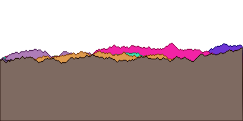

マクロが最も効果的な場面の一つは、 **ドメイン特化言語(DSL)** を作る場面である。
DSLプログラミングは高度なマクロプログラミングテクニックの1つで、難しい問題を解くために、Lispの構造をその問題に最適な言語へと大幅に変更するというものである。
DSLプログラミングにマクロが必須というわけではないが、Lispではいくつかのマクロを書くことで簡単にDSLを作ることができる。

# 17.1 ドメインとは何か

例えば、「平均的なプログラム」というものを思い浮かべたとしても、個々のプログラムはその「平均」からは外れている。
すなわち、各プログラムは、特定の問題を解くために作られる。
そして、人が考えを及ぼす領域( **ドメイン** )には、それぞれ、その領域でこれまでに考え出された様々な枠組みがあり、それが問題を解くプログラムの書き方にも影響を与える。
**DSL** を使うと、元のプログラミング言語を、ドメイン特有の枠組みに合わせた言語へ拡張できる。

ここからは、特定のドメインを取り上げて、そのドメインでLispを使いやすくするDSLを2つ作ってみる。

**作成するDSL**

- SVG(scalable vector graphics)ファイルを書き出すためのDSL
- 魔法使いのアドベンチャーゲームのコマンドのためのDSL

# 17.2 SVGファイルを書き出す

SVGフォーマットは、グラフィクスの描画のためのファイルフォーマットである。
円や多角形といったオブジェクトを配置し、コンピュータによってそれを描画する。
SVGフォーマットでは、画像をピクセルではなくベクタによって記述するため、SVGイメージは任意の大きさに拡大縮小して描画できる。

SVGフォーマットはWebブラウザで描画できる。
実際に、SVGフォーマットのファイルをWebブラウザで描画してみる。

```xml
<svg xmlns="http://www.w3.org/2000/svg">
	<circle cx="50" cy="50" r="50" style="fill:rgb(255,0,0);stroke:rgb(155,0,0)">
	</circle>
	<circle cx="100" cy="100" r="50" style="fill:rgb(0,0,255);stroke:rgb(0,0,155)">
	</circle>
</svg>
```

## タグマクロを使ってXMLとHTMLを生成する

XMLフォーマットは(HTMLフォーマットと同様に)入れ子になったタグによって構成されている。
開きタグは、それぞれ、閉じタグと対になっている。
閉じタグは、開きタグと同じ名前だが、先頭に`/`がついている。
また、タグには属性をつけられる。

```xml
<mytag color="BLUE" height="9">
	<inner_tag>
	</inner_tag>
</mytag>
```

### マクロの補助関数を書く

マクロを作成していると、マクロの仕事の大部分は関数でこなせると気付く場面が多々ある。
実際、マクロの仕事の殆どは補助関数に任せて、それからマクロを実装する方が良い。
そうすれば、マクロそのものはシンプルに保てる。

ここからは、LispからXML形式のタグを出力するための補助関数を先に作成する。
まず、補助関数`print-tag`を作成する。
この関数は、1つの開きタグ、または閉じタグを出力する。

```lisp
(defun print-tag (name alst closingp)
  "xmlフォーマットの開きタグ、または、閉じタグを出力する
   name: タグ名
   alst: 属性名と属性値のコンスセルのリスト
   closingp: 閉じタグか否か"
  (princ #\<)  ; タグの開き角括弧
  ;; 閉じタグならタグ名の頭に/をつける
  (when closingp
    (princ #\/))
  ;; タグ名を小文字に変換する
  (princ (string-downcase name))
  ;; 小文字の属性名と属性値を出力する
  (mapc (lambda (att)
          (format t " ~a=\"~a\"" (string-downcase (car att)) (cdr att)))
        alst)
  (princ #\>))  ; タグの閉じ角括弧
```

```lisp
> (print-tag 'mytag '((color . blue) (height . 9)) nil)
<mytag color="BLUE" height="9">
```


この通り、XMLタグを出力するだけであればこの関数で十分である。
しかし、全てのタグ出力をこのように出力するのは手間がかかる。
そこで、`tag`マクロを書いて効率化を図る。

### tagマクロを作る

これから書く`tag`マクロは、 **Paul Graham** によるLisp方言Arcにある同名のマクロを採用したものである。
このマクロでは、`print-tag`を次の3点において改善する。
どれも、マクロでなければ改善できないものばかりである。

- タグは常に対になっている必要がある。
  しかし、タグがネストしていると、1つの関数だけでは閉じタグと開きタグの間に、内側の要素のタグを表記できない。
  ネストを考慮しつつタグを対にして表示するには、内側のタグの表示処理の実行前と実行後に外側のタグの表示処理を実行する必要があるが、関数は実行前に引数が全て実行されてしまう。
- タグ名と属性名は動的に変える必要がないため、静的なデータとして持っておいて良い。
  すなわち、そのようなデータに対してクオートをつけて呼び出すのは手間である。換言すれば、タグ名はデフォルトでデータモードとして扱われるべきである。
- タグ名と違い、属性値の方は一般的に動的に変えられる。
  したがって、ここで作るマクロでは、属性値はコードモードとする。そして、Lispコードを書いておけばその実行結果が属性値として使えるようにする。

これらをまとめると、例えばREPL上で`tag`マクロを使ったら次のように実行されてほしいわけである。

```lisp
> (tag mytag (color 'blue height (+ 4 5)))
<mytag color="BLUE" height="9"></mytag>
```

タグ名と属性リストがクオートされていないことに注目すること。
また、属性値にLispコードを書いて計算させていることにも注目すること。

これを実現する`tag`マクロのコードを次に示す。

```lisp
(defmacro tag (name atts &body body)
  `(progn (print-tag ',name
                     (list ,@(mapcar (lambda (x)
                                       `(cons ',(car x) ,(cdr x)))
                                     (pairs atts)))
                     nil)
          ,@body
          (print-tag ',name nil t)))
```

マクロは、まず`print-tag`を呼んで開きタグを生成する。
この部分は、属性の`alist`を作成する必要があり、しかも属性の部分はコードモードにする必要があるため、少々複雑なコードとなっている。
まず、属性リスト属性名と属性値の組を`pairs`関数(前章で作成した)で切り出し、それに対して`mapcar`を適用して、`print-tag`関数に渡す属性リストを生成している。
属性名の方はクオートし、属性値の方は式のままとしている。
`tag`マクロの残りの引数に渡されたコードを開きタグの次に実行するようにして、最後に閉じタグを出力している。

ネストしたタグの例を次に示す。
みやすさを考慮して改行とインデントを入れている。

```lisp
> (tag mytag (color 'blue size 'big)
       (tag first_inner_tag ())
       (tag second_inner_tag ()))
<mytag color="BLUE" height="9">
	<first_inner_tag>
	</first_inner_tag>
	<second_inner_tag>
	</second_inner_tag>
</mytag>
```

### tagマクロを使ってHTMLを生成する

当然だが、`tag`マクロはXMLにもHTLにも使える。
例えば、"Hello World"を表示するHTMLドキュメントを生成するコードは次のとおりである。

```lisp
> (tag html ()
    (tag body ()
      (princ "Hello World!")))
<html><body>Hello World!</body></html>
```

HTMLはXMLと異なり、使えるタグ名が既に定まっている。
したがって、それぞれのHTMLタグを出力する簡易マクロを定義しておけば、LispからHTMLを生成するのが更に簡単になる。

```lisp
(defmacro html (&body body)
  `(tag html ()
        ,@body))

(defmacro body (&body body)
  `(tag body ()
        ,@body))
```

```lisp
> (html
    (body
      (princ "Hello World!)))
<html><body>Hello World!</body></html>
```

### SVG特有のマクロと関数を作る

ここからは、DSLをSVGのドメインに向けて拡張していく。
まず、SVGの画像全体を囲む`svg`マクロを書いてみる。

```lisp
(defmacro svg (width height &body body)
  `(tag svg (xmlns "http://www.w3.org/2000/svg"
                   "xmlns:xlink"
                   "http://www.w3.org/1999/xlink"
                   height ,height width ,width)
        ,@body))
```

SVGイメージには、次の2つの属性を用意する。

- 1つ目の属性・・・`xmlns`属性。SVGビューワ(例えばWebブラウザ)がSVGフォーマットのための適切なドキュメントを参照できるようにする。
- 2つ目の属性・・・画像の中にハイパーリンクを置けるようにする。

画像を描くためには色を扱えなければならない。
簡単のために、色はRGBのリストとして表現することとする。
つまり、`(255 0 0)`は真っ赤な色を表す。
特定の色を基準に、より明るい色やより暗い色が必要になる場合がある。
そういった場合のために、`brightness`関数を定義する。

```lisp
(defun brightness (col amt)
  (mapcar (lambda (x)
            (min 255 (max 0 (+ x amt))))
          col))
```

明るい赤をこの関数に渡し、輝度調整値`amt`に`-100`を渡せば、暗い赤が返される。

```lisp
> (brightness '(255 0 0) -100)
(155 0 0)
```

次に、SVGの描画要素のスタイルを生成する関数を実装する。

```lisp
(defun svg-style (color)
  "表面の色と、枠線の色のスタイルを出力する
   スタイルは、枠線の色=表面の色-100"
  (format nil
          "~{fill:rgb(~a,~a,~a);stroke:rgb(~a,~a,~a)~}"
          (append color (brightness color -100))))
```

次に、円を描く関数を実装する。

```lisp
(defun circle (center radius color)
  "円を描画する
   center: 円の中心の座標(コンスセル)
   radius: 円の半径
   color: 円の色(r,g,b)"
  (tag circle (cx (car center)
               cy (car center)
               r radius
               style (svg-style color))))
```

```lisp
> (svg 150 150
       (circle '(50 . 50) 50 '(255 0 0))
       (circle '(100 . 100) 50 '(0 0 255)))

<svg xmlns="http://www.w3.org/2000/svg" xmlns:xlink="http://www.w3.org/1999/xlink" height="150" width="150">
	<circle cx="50" cy="50" r="50" style="fill:rgb(255,0,0);stroke:rgb(155,0,0)"></circle>
	<circle cx="100" cy="100" r="50" style="fill:rgb(0,0,255);stroke:rgb(0,0,155)"></circle>
</svg>
```


これで、基本的なSVG DSLは作成できた。
ここからは、機能をどんどん追加していく。

### もっと複雑なSVG画像を描画する

SVG DSLに、任意の多角形(ポリゴン)を描く関数を追加する。
SVGのポリゴンは頂点座標を`points`属性に格納する。
頂点のリストは、`format`関数の`~{~}`制御文字列を使って生成している。
11章の「`format`関数でテキストを表示する」で見たように、この制御文字列は引数に渡されたリストをループする。
ここでは頂点をループするためにまず、座標値のペアのリストを`mapcan`によってネストのないリストへと *スプライス* している。  
すなわち、`mapcan`=`mapcar`+`append`である。

```lisp
(defun polygon (points color)
  (tag polygon (points (format nil
                               "~{~a,~a ~}"
                               (mapcan (lambda (tp)
                                         (list (car tp) (cdr tp)))
                                       points))
                       style (svg-style color))))
```

次の例は、 **ランダムウォーク** を表現する関数である。
ランダムウォークとは、1歩進む度に方向をランダムに変えながら歩く軌跡を表すグラフである。
横方向は右に一定に進み、上下のみランダムにすれば、株価変動のようなグラフが表現できる。
実際に、金融市場のモデルの初期値として使用されることもある。

```lisp
(defun random-walk (value length)
  "1次元のランダムウォークの軌跡をリストで返す
   value: 初期値
   length: ランダムウォークの長さ
   ret: ランダムウォークの軌跡のリスト"
  (unless (zerop length)
    (cons value
      (random-walk (if (zerop (random 2))
                       (1- value)
                       (1+ value))
                   (1- length)))))
```

実行結果は次のとおりである。

```lisp
> (random-walk 100 10)
(100 101 100 99 100 101 102 101 102 101)
```

では、SVG DSLを使って、いくつかのランダムウォークをSVG画像として表示してみる。

```lisp
;; ランダムウォークを描画したSVGファイルを作成する
(with-open-file (*standard-output* "random-walk.svg"
                                   :direction :output
                                   :if-exists :supersede)
  ;; svg画像を描画する
  ;; 横: 400
  ;; 縦: 200
  ;; 描画対象: 上辺がランダムウォークの多角形10個
  ;; 色: ランダム
  (svg 400 200 (loop repeat 10
                do (polygon (append
                              ;; 左下の頂点
                              '((0 . 200))
                              ;; 左上から右上までの頂点
                              (loop for x
                                    for y in (random-walk 100 400)
                                    collect (cons x y))
                              ;; 右下の頂点
                              '((400 . 200)))
                            ;; 多角形の色
                            (loop repeat 3
                                  collect (random 256))))))
```



ここまでで、Lispによって簡単にXML,HTML,SVGのためのDSLが書けることが分かった。
これらのDSLは、どれも、Lispのリスト構造そのものを、見た目を表現するためのマークアップ言語に変換するものだった。

次の章では、全く別の種類のDSLを作成する。

# 17.3 魔法使いのアドベンチャーゲームに新コマンドを追加する

この章では、ゲームにありがちな問題を解決するためのDSLを実装する。
つまり、特定のアイテム、特定の場所、それらの組み合わせによって、特別なコマンドが起動できるようにする。

コマンドの実現方針としては、次のとおりである。

- ゲームとして共通の部分は、何度も記述したくない
- 特定のアイテムに特有の処理については、Lispで直接コーディングしたい

これらを実現するためのDSLについて、ここから学んでいく。
まずは、[魔法使いのアドベンチャーゲーム](https://github.com/otaon/LandOfLisp-AdventureGame/blob/master/AdventureGame.lisp)をREPLにロードしておくこと。
さもなければ本章のコードは実行できない。

**NOTE:** `game-repl`コマンドと使って直接コマンドを入力できること、および、`game-repl`から抜けるには`quit`コマンドを使うように実装したことを思い出すこと。

```lisp
;; ゲームの実行例
> (load "AdventureGame.lisp")
;; Loading file AdventureGame.lisp ...
;; Loaded file AdventureGame.lisp
T
> (game-repl)
You are in the living-room. Awizard is snoring loudly on the couch. .......
quit
```

## ゲームコマンドを直接定義する

ゲームDSLは、結局の所どのようにあるべきか。
それを知るために、まずはいくつかのコマンドを直接LSIPで書いてみることにする。
その後、異なるコマンドの間に存在する **共通パターン** を見つけ出して、それを基礎としてDSLを作成することにする。

### 「溶接」コマンド

魔法使いの屋敷の屋根裏には、溶接機がある。
プレイヤーが鎖とバケツを屋根裏に持っていき、バケツに鎖を溶接できる(`weld`)ようにしてみる。

まず、プレイヤーが特定のアイテムを持っているか否かを調べやすくするため、`have`関数を定義している。
プレイヤーの持ち物全てを返す`inventory`コマンドの返り値に引数のアイテムが含まれていれば、プレイヤーはそのアイテムを持っていることになる。

```lisp
(defun have (object)
  (member object (cdr (inventory))))
```

次に、鎖とバケツが溶接されているかどうかという情報を保持する必要がある。
ゲームにおいて、これらのアイテムが溶接されているときのみ可能なアクションがあるかもしれない。
この目的のためにグローバル変数`*chain-welded*`を用意する。

```lisp
(defparameter *chain-welded* nil)
```

最後に、溶接(`weld`)コマンドを定義している。
溶接は、次の条件を全て満たす時に可能となる。

- プレイヤーが屋根裏にいる
- `weld`コマンドでは、「バケツ**を**」「鎖**に**」溶接する、というアクションのみを処理する
- プレイヤーは、既に鎖とバケツを持っている必要がある
- 鎖とバケツはまだ溶接されていない状態である必要がある

```lisp
(defun weld (subject object)
  (if (and (eq *location* 'attic)
           (eq subject 'chain)
           (eq object 'bucket)
           (have 'chain)
           (have 'bucket)
           (not *chain-welded*))
    (progn (setf *chain-welded* t)
           '(the chain is now securely welded to the bucket.))
    '(you cannot weld like that.)))
```

`game-repl`には、予め登録されているコマンドのみ実行可能にしている。
したがって、`weld`コマンドを使用するために、許可コマンドリストに`weld`を追加する必要がある。
`pushnew`コマンドを使うことで、`weld`がまだ許可コマンドリストに追加されていない場合にのみ`push`されるようになる。

```lisp
> (pushnew 'weld *allowed-commands*)
(WELD LOOK WALK PICKUP INVENTORY)
> (game-repl)
weld chain bucket
You cannot weld like that.
```

### 「投げ入れる」コマンド

魔法使いの野屋敷の庭には井戸がある。
プレイヤーがバケツを投げ入れて(dunk)、水を汲めるようにする。

`weld`と同様に、まずバケツに水が入っているかどうかを覚えておく変数を用意する。

```lisp
(defparameter *bucket-filled* nil)
```

次に、`dunk`関数を定義する。
`weld`同様に、`dunk`にも「投げ入れる」動作をしても良いか判断するための条件式がある。

```lisp
(defun dunk (subject object)
  (if (and (eq *location* 'garden)
           (eq subject 'bucket)
           (eq object 'well)
           (have 'bucket)
           *chain-welded*)
      (progn (setf *bucket-filled* t)
             '(the bucket is now full of water))
      '(You cannot dunk like that.)))
```

最後に、`dunk`関数を許可コマンドリストに追加する。

```lisp
(pushnew 'dunk *allowed-commands*)
```

## `game-action`マクロ

先述の`weld`コマンドと`dunk`コマンドを実装したことで、これらに似た処理の部分があることが分かった。
また、それぞれのコマンドには、コマンド固有の処理というものが存在することも分かった。
これらを上手くまとめ上げるために、`game-action`マクロを作成する。

```lisp
(defmacro game-action (command subj obj place &body body)
  ;; ゲームアクションを定義するマクロ
  ;; command: コマンド名
  ;; subj: コマンド実行に必要な主体
  ;; obj: コマンド実行に必要な客体
  ;; place: コマンド実行に適した場所
  ;; body: コマンド処理本体
  `(progn
     ;; コマンド定義
     (defun ,command (subject object)
       ;; コマンド実行可能条件
       (if (and (eq *location* ',place)  ; 有効な場所
                (eq subject ',subj)  ; 有効な主体
                (eq object ',obj)  ; 有効な客体
                (have ',subj))  ; 主体を持っている
           ;; コマンド実行 
           ,@body
           ;; コマンド実行不可時のメッセージ
           '(i cant ,command like that.)))
     ;; 許可コマンドリストに定義したコマンドを追加
     (pushnew ',command *allowed-commands*)))
```

`game-action`マクロの主な仕事は、コマンドを実現する新たな関数を定義することである。
このように、マクロはその中で関数定義することも可能である。

このマクロの中では、場所、主体となるアイテムの有無、客体となるアイテムの有無、主体を持っているか否かのチェック機構を入れている。
しかし、それ以外の条件は、コマンドごとに本体の中でチェックするようにしている。

共通部分の条件が満たされたら、追加のチェックは各コマンドのロジックの中で書くようにする。
共通部分の条件が満たされなかったら、「コマンド実行不可時のメッセージ」を返す。
最後に`pushnew`を使って、作成したコマンドを`game-repl`の「許可コマンドリスト」に追加する。

このマクロで実装していないのは、状態を管理するグローバル変数を定義したり変数したりする処理である。
すなわち、`*chain-welded*`や`*bucket-filled*`といった変数を作るなら、マクロとは別に実装する必要がある。
何故別々に実装するようにするのか。
理由は、特定のコマンドと、特定の状態を管理する変数が1対1対応するとは限らないからである。
コマンドによっては、状態を持たずに実行できるものもあるだろうし、反対に、複数の状態に依存するものもあるだろう。

このマクロによって、新しいゲームアクションを作るための簡単なDSLが完成した。
すなわち、このコマンドによって、ゲームコマンドのドメインに特化した新たなプログラミング言語が作り出されたということになる。

`weld`と`dunk`を、このDSLを使って書き直してみる。

```lisp
(defparameter *chain-weided* nil)

(game-action weld chain bucket attic
  (if (and (have 'bucket) (not *chain-welded*))
      (progn (setf *chain-welded* 't)
             '(the chain is now securely welded to the bucket.))
             '(you do not have a  bucket.)))

(defparameter *bucket-filled* nil)

(game-action dunk bucket well garden
  (if *chain-welded*
      (progn (setf *bucket-filled* 't)
             '(the bucket is now full of water))
             '(the water level is too low to reach.)))
```

見て分かる通り、各コマンドのロジックが簡潔に表されている。
`weld`はバケツを持っていることをチェックしているが、`dunk`ではwellをチェックする必要はないことが分かりやすい。

マクロでゲームコマンドDSLを作る利点をもっと示すために、より複雑なコマンドを実装してみる。
次に示すコマンドは、状況によって3つの異なる結果を返す。

- バケツが空の場合、特に何も起こらない。(メッセージ:バケツは空だ)
- バケツが一杯で既にカエルを取っていた場合、プレイヤーの負けとなる。
- バケツが一杯でカエルを取っていなかった場合、プレイヤーの勝利となる。

```lisp
(game-action splash bucket wizard living-room
  (cond ((not *bucket-filled*) '(the bucket has nothing in it.))
        ((have 'frog) '(the wizard awakens and sees that you stole his frog.
                        he is so upset he banishes you to the netherworlds- you lose! the end.))
        (t '(the wizard awakens from his slumber and greets you warmly.
             he hands you the magic low-carb donut- you win! the end.))))
```

`game-action`マクロを使えば、それぞれの特徴的なゲームアクションコマンドをたくさん作成できる。
しかも、似たようなコードを繰り返し書く手間を省ける。

**NOTE:**  
`game-action`コマンドは、捜査の対象となるアイテムを束縛した変数`subject`と`object`をマクロのボディ中で使えるようにする。
ゲームコマンドはこれらの変数で情報にアクセスできるようになるが、`game-action`コマンドを作り出すコードが`subject`や`object`という名前の変数を既に使用している場合は、名前衝突を起こす。
安全を期すなら、`gensym`コマンドを用いたマクロに書き直したほうが良い。
