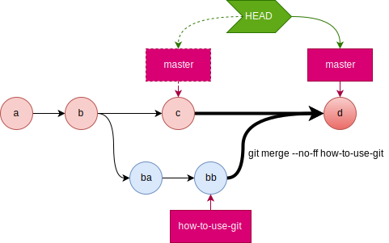
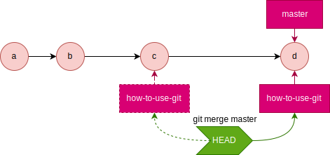
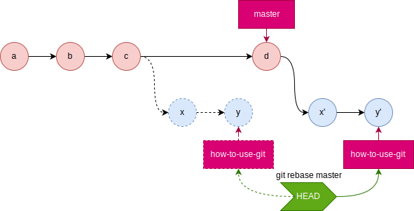
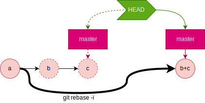

# 目的
Gitを端末上で使用するため、操作とそのコマンドを記す。

# 操作の種類一覧
1. 情報更新/情報表示
  1. リモートリポジトリの情報をローカルリポジトリに反映する(フェッチ)
  1. ローカルブランチ&リモートブランチを一覧表示
  1. 現在のブランチ状態を表示
  1. コミットログを表示
1. リポジトリ操作
  1. リポジトリを新規作成する
  1. リモートリポジトリからローカルリポジトリをクローンする
  1. リモートリポジトリをローカルリポジトリに関連付ける
  1. 現在のローカルリポジトリのブランチを`push`
  1. リモートリポジトリのブランチを`pull`
1. ブランチ操作
  1. ローカルブランチを作成/削除する
  1. ローカルブランチを切り替える(`checkout`する)
  1. ローカルブランチに対応するリモート追跡ブランチを確認する
  1. 既存のリモートブランチに対応するローカルブランチを作成する
  1. ローカルブランチを作成し、リモートブランチを対応付けて作成する
  1. 現在のブランチに、指定コミットの指定ファイルを展開する
  1. 指定したブランチを現在のブランチにマージ
  1. マージ時のコンフリクトを解消する
  1. コミット履歴を改竄する(`rebase`)
1. ファイル操作
  1. ファイルをステージングする
  1. ステージング済みのファイルをリポジトリへコミット
  1. 直前のコミットを修正
  1. 変更をリセット
  1. ファイル内容確認(`grep`)
  1. ファイルを移動する/ファイルを削除する/ファイルをリネームする
1. 差分(`diff`)確認
  1. 様々な差分(`diff`)を確認
1. 問題を特定する
  1. 二分探索で問題を特定する

----

# 情報更新/情報表示
## リモートリポジトリの情報をローカルリポジトリに反映する(フェッチ)
**NOTE:** `fetch`が実際にやっているのは、リモート追跡ブランチの作成。

```bash
# シンタックス
$ git fetch [リポジトリ略称 ブランチ名]
# 例:リモートブランチhow-to-use-gitのリモート追跡ブランチを作成
$ git fetch origin how-to-use-git
From github.com:otaon/web
 * branch            how-to-use-git -> FETCH_HEAD
```

- `[ブランチ名]` 作成対象となるリモート追跡ブランチ。省略すると全てのリモート追跡ブランチを作成する。

## ローカルブランチ&リモートブランチを一覧表示
```bash
# シンタックス
$ git branch [-a|-r|--merged|--no-merged] [--color|--no-color] 
# 例:ローカルとリモートのブランチを全て一覧表示
$ git branch -a
  how-to-make-web-page-with-hugo
* how-to-use-git
  how-to-use-mermaid-in-hugo
  master
  migrate-from-gist-to-githubio
  remotes/origin/gh-pages
  remotes/origin/how-to-make-web-page-with-hugo
  remotes/origin/how-to-use-git
  remotes/origin/how-to-use-mermaid-in-hugo
  remotes/origin/master
  remotes/origin/migrate-from-gist-to-githubio
```

- `[-a]` ローカルとリモートの全てのブランチ情報表示。省略した場合はローカルのみ。
- `[-r]` リモートの全てのブランチ情報表示。
- `[-merged]` HEADにマージ済みのブランチ情報表示。
- `[-no-merged]` HEADにマージされていないブランチ情報表示。
- `[-color]` ブランチ情報に色を付けて表示。
- `[-no-color]` ブランチ情報に色を付けずに表示。

## 現在のブランチ状態を表示
現在いるブランチ、そのupstream、ファイルのステージング状況を表示する。

```bash
# シンタックス
$ git status
# 例:現在のブランチ状態を表示
$ git status
On branch how-to-use-git
Your branch is up to date with 'origin/how-to-use-git'.

Changes not staged for commit:
  (use "git add <file>..." to update what will be committed)
  (use "git checkout -- <file>..." to discard changes in working directory)

        modified:   content/ja-jp/posts/0027_how_to_use_git/index.md

no changes added to commit (use "git add" and/or "git commit -a")
```

## コミットログを表示
```bash
# シンタックス
$ git log [--pretty=short] [--graph] [-数字] [-p|-u|--patch 対象ファイルパス*] [--decorate]
# 例:コミットログ直近2件分をグラフ形式で表示
$ git log -2 --graph
* commit d37e53c8f12bfba66c1bd1accce89ca6bcbc33a0 (HEAD -> how-to-use-git, origin/how-to-use-git)
| Author: otaon <******@github.com>
| Date:   Tue Mar 12 03:24:19 2019 +0900
|
|     feature: add figure of `merge`
|
* commit de2baba4ddb3f7469aba02f88190a790523312cd
| Author: otaon <******@github.com>
| Date:   Mon Mar 11 02:28:11 2019 +0900
|
|     feature: edit an article
```

- `[--pretty=short]` 表示メッセージを短くする。
- `[--graph]` ブランチをグラフ表示する。
- `[-数字]` 指定した通じの数だけログを表示する。
- `[-p|-u|--patch 対象ファイルパス*]` 指定ファイルの差分をパッチ形式で表示する。
- `[--decorate]` 現在のHEAD、ブランチ名、タグ名を表示する。

----

# リポジトリ操作
## リポジトリを新規作成する
```bash
# -*- ローカルリポジトリを作成する -*-
# シンタックス
$ git init [ディレクトリ]
# 例:ローカルリポジトリwebを作成する
$ git init web

# -*- リモートリポジトリを作成する -*-
# シンタックス
$ git init --bare --shared [ディレクトリ]
# 例:リモートリポジトリwebを作成する
$ git init --bare --shared web
```

- `[ディレクトリ]` 指定したディレクトリに`.git`というサブディレクトリが作成される。省略時はカレントディレクトリ。
- `--bare` 最小限のリポジトリを作成する。もし環境変数`GIT_DIR`が設定されていなければ、現在のワーキング・ディレクトリが設定される。[^git環境変数]
- `--shared` Gitリポジトリが複数のユーザで共有されることを指定する。このオプションは、同じグループに属するユーザがそのリポジトリにpushすることを許可する。

[^git環境変数]:`.git`フォルダの場所を指す環境変数。指定されていない場合、Gitはディレクトリツリーを`~`または`/`にたどり着くまで上っていき、各ディレクトリで`.git`ディレクトリを探す。[10.8_Gitの内側-環境変数](https://git-scm.com/book/ja/v2/Git%E3%81%AE%E5%86%85%E5%81%B4-%E7%92%B0%E5%A2%83%E5%A4%89%E6%95%B0)

## リモートリポジトリからローカルリポジトリをクローンする
既にリモートリポジトリが存在する時、それを元にローカルリポジトリをクローンする。

```bash
# シンタックス
$ git clone リモートリポジトリ名 [ディレクトリ]
# 例:リモートリポジトリgit@github.com:otaon/web.gitをローカルリポジトリwebとしてクローンする
$ git clone git@github.com:otaon/web.git web
```

- `[ディレクトリ]` 指定したディレクトリを作成してリモートリポジトリ内のデータを置く。  
  省略した場合はリモートリポジトリ名のディレクトリを作成してリモートリポジトリ内のデータを置く。

## リモートリポジトリをローカルリポジトリに関連付ける
既にローカルリポジトリとリモートリポジトリが存在する時、それをリモートリポジトリに関連付ける。

```bash
# シンタックス
$ git remote add リモートリポジトリの略称 リモートリポジトリのURL
# 例:リモートリポジトリgit@github.com:otaon/web.gitを略称originとしてローカルリポジトリwebに関連付ける
$ git remote add origin git@github.com:otaon/web.git
```

## 現在のローカルリポジトリのブランチを`push`
```bash
# シンタックス
$ git push [-u|--set-upstream] リモートリポジトリの略称 ブランチ名
# 例:現在のHEADをoriginのhow-to-use-gitブランチにpush
$ git push origin how-to-use-git
```

- `[-u|--set-upstream]` ローカルリポジトリ/現在ブランチの**upstream**をリモートリポジトリの略称/ブランチ名に設定する。  
  こうすると、次回からは`git push`で**upstream**にpushできるようになる。

## リモートリポジトリのブランチを`pull`
```bash
# シンタックス
$ git pull リモートリポジトリの略称 ブランチ名
# 例:originのhow-to-use-gitを、対応するローカルブランチにpull
$ git pull origin how-to-use-git
```

----

# ブランチ操作
## ローカルブランチを作成/削除/名称変更/リモート追跡ブランチ変更する
### ローカルブランチを作成する
ローカルブランチを作成する。  
リモート追跡ブランチが作成されている場合は、それを元にローカルブランチを作成する。

```bash
# シンタックス
## ブランチ作成
$ git branch ブランチ名 [リモート追跡ブランチ名]

# 例:ローカルブランチhow-to-use-gitを作成する
$ git branch how-to-use-git

# 例:ローカルブランチhow-to-use-gitをorigin/how-to-use-gitに関連付けて作成する
$ git branch how-to-use-git origin/how-to-use-git
```

### ローカルブランチを削除する
```bash
## ブランチ作成
$ git branch (-d|-D) ブランチ名 [リモート追跡ブランチ名]
```

### ローカルブランチ名を変更する
```bash
## ブランチ名変更
$ git branch -m [古いブランチ名] 新しいブランチ名
```

### リモート追跡ブランチを設定する
```bash
## リモート追跡ブランチを設定
$ git branch -u 追跡対象のリモートブランチ名 [ローカルブランチ名]
```

### リモート追跡ブランチの設定を解除する
```bash
## リモート追跡ブランチの設定を解除
$ git branch --unset-upstream [ローカルブランチ名]
```

## ローカルブランチを切り替える(`checkout`する)
```bash
# シンタックス
$ git checkout [-b] [-f] ブランチ名
# 例:ローカルブランチをチェックアウトする
$ git checkout master # masterをチェックアウト(作成はしない)
$ git checkout -b how-to-use-git # hot-to-use-gitブランチを作成してチェックアウト
```

- `[-b]` リモートに対応付けてブランチを作成&チェックアウト。  
**NOTE:** `-b`は`git branch ブランチ名; git checkout ブランチ名`のショートハンド。
- `[-f]` 作業ブランチやステージに変更があった場合でも、それを強制的に破棄してチェックアウトする。

## ローカルブランチに対応するリモート追跡ブランチを確認する
```bash
$ git branch -vv
```

## 既存のリモートブランチに対応するローカルブランチを作成する
リモートブランチは直接チェックアウトできない。  
そこで、リモートブランチに対応する**リモート追跡ブランチ**を作成し、それからローカルブランチをチェックアウトする。  
リモート追跡ブランチが存在する場合、そのブランチ名をチェックアウトすると、下記が自動的に行われる。

- `git checkout リモート追跡ブランチ名` で、ローカルブランチが自動的に作成される。
- 作成されたローカルブランチの**upstream**ブランチに、リモートブランチが自動的に設定される。
- この方法は効率が悪い。  
`git pull origin how-to-use-git && git checkout how-to-use-git` として、  
リモート追跡ブランチ作成、ローカルブランチ更新を同時に行った方が効率が良い。

```bash
# 例:リモートで作られたブランチを、ローカルにチェックアウトする
# 1.特定のリモート追跡ブランチを作成
$ git fetch origin how-to-use-git
# 2.ローカルブランチをチェックアウトする
$ git checkout how-to-use-git

## NOTE:ローカルブランチは自動的に作成される
```

## ローカルブランチを作成し、リモートブランチを対応付けて作成する
ローカルブランチ `file-system` を作成する。

```bash
git branch -b file-system
```

ローカルブランチに対応するリモートブランチを作成する。

```bash
git push -u origin file-system
```

## 現在のブランチに、指定コミットの指定ファイルを展開する
```bash
# シンタックス
$ git checkout [コミットSHA] ファイルパス
# 例:コミットafpj73zのindex.htmlを現在のブランチに展開する
$ git checkout afpj73z index.html
```

- `[コミットSHA]` 展開対象のファイルがあるコミット。省略時は現在のindexのコミットを指す。

## 指定したブランチを現在のブランチにマージ
```bash
# シンタックス
$ git merge [--no-ff] ブランチ名
# 例:how-to-use-gitブランチを現在のブランチにマージ
$ git merge --no-ff how-to-use-git
```

## マージ時のコンフリクトを解消する
### コンフリクト時のファイル表記の意味
```gitdiff
\<<<<<<< HEAD
AAAA
=======
BBBB
\>>>>>>> master
```

`HEAD`では'AAAA'に変更しているが、`master`では'BBBB'に変更している。

### 片方のコミット内容を全て採用する
```bash
# HEAD側を優先する
$ git checkout --ours how-to-use-git.md

# HEADと反対側を優先する
$ git checkout --theirs how-to-use-git.md
```

**NOTE** indexが変化するのはカレントブランチであり、引数で指定したindexは一切変化しない事を覚えておくこと。  
つまり、`merge`実行時のカレントブランチは常に「変更を取り込む側」となる。

- `master`ブランチにいるときに`git merge --no-ff `
  - featureブランチでの開発が完了してmasterブランチにマージしたい場合などに用いる。
  - 

- `how-to-use-git`ブランチにいるときに`git merge [--ff] master`
  - featureブランチを作成したまま放置していたらmasterが進んでしまった場合などに用いる。
  - 

## コミット履歴を改竄する(`rebase`)
### ブランチの開始地点を変更する
ブランチ元にコミットが発生した時、それに追従するために、ブランチの開始地点を、ブランチ元の新しいHEADに変更する。

```bash
# シンタックス
$ git rebase [ブランチ元] [現在のブランチ]
# 例:how-to-use-gitブランチの付け根(base)をmasterのHEADの位置にrebaseする
$ git rebase master how-to-use-git
```



### 複数のコミットを一つにまとめる
複数のコミットをまとめた、新しいコミットを作る。(つまりSHAが変わることに注意)

```bash
# シンタックス
$ git rebase -i 改竄対象の直前のコミット
# 例:現在のブランチの直近2件を1件にまとめ上げる。SHAは変わってしまう。
$ git rebase -i HEAD~2

# エディタで、HEADを含めて2つまでのコミット履歴をpickからfixupに編集する
### 編集前 ###(上の方が古い)
# pick 7a34294 first commit
# pick 6fba227 second commit

### 編集後 ###(2つ目のコミットをfixupに変更)
# pick 7a34294 first commit
# fixup 6fba227 second commit
```



----

# ファイル操作
## ファイルをステージングする
```bash
# シンタックス
$ git add [--all|ファイル+]
# 例:index.htmlをステージングする(indexに登録する、とも言う)
$ git add index.html
```

- `--all` 変更が加えられたファイルと未追跡だったファイルをaddする

## ステージング済みのファイルをリポジトリへコミット
```bash
# シンタックス
$ git commit [-m "コミットメッセージ"]
# 例:ステージング済みのファイルをコミットする
$ git commit -m "feature: edit index.html"
```

## 直前のコミットを修正
```bash
# シンタックス:直前のコミットを修正
## コミットメッセージも修正
$ git commit --amend # -> エディタでメッセージを修正
## コミットメッセージは修正しない
$ git --amend --no-edit

# 例:直近のコミットのメッセージだけを変更する
$ git commit --amend # -> エディタでメッセージを修正
# 例:直近のコミットだけを修正する
$ git add --all ## 何らかの修正をステージング
$ git commit --amend --no-edit ## 直前のコミットにまとめる(メッセージは変えない)
```

## 変更をリセット
```bash
# シンタックス
$ git reset [--soft|--mixed|--hard] [HEAD|HEAD^|SHA|ブランチ名]
# 例:変更をリセットする & リセットをリセットする
git reset --mixed HEAD # addを取り消す
git reset --hard ORIG_HEAD # git resetを取り消す
```

- `--soft` HEADの位置のみリセットする。(`commit`のみ取り消し)
- `--mixed|指定なし` HEADの位置とindexをリセットする。(`add`と`commit`を取り消し)
- `--hard` HEADの位置とindexとワークツリー内容をリセットする。(ワークツリーの編集内容と`add`と`commit`を取り消し)

## ファイル確認(`grep`)
```bash
$ git grep [-w] [-i] (単語|[--not] -e '正規表現' [(--and|--or [--not]) -e ...*]) [対象パス]
```

- `-e '正規表現'` 正規表現にマッチしたものにヒットする。`'\(foo\|bar\)'`でfoo**か**barを含む行にヒットする。
- `[--not] ...` 正規表現にマッチしたものを除外する。
- `[--and ...]` 複数の正規表現のandを取る。`-e 'foo' --and -e 'bar'`でfoo**と**barを含む行にヒットする。
- `[--or ...]` 複数の正規表現のorを取る。`-e 'foo' --or -e 'bar'`でfoo**か**barを含む行にヒットする。
- `[-w]` 単語を検索する。`git grep -w user`で、`user`のみ(つまり`users`などは除く)を検索する。
- `[-i]` 大文字小文字を無視する。

## ファイルを移動する/ファイルを削除する/ファイルをリネームする
### gitで追跡させつつファイルを移動/リネームする
```bash
# シンタックス
$ git mv ファイル名 (移動先パス|リネーム後ファイル名)
# 例:ファイルを移動する
$ git mv how-to-use-git.md path/to/move/
```

### gitで追跡させつつファイルを削除する
```bash
# シンタックス
$ git rm ファイル名
# 例:ファイルを削除する
$ git rm  ファイル名
```

## ファイルをgit管理下から外す
```bash
# シンタックス
$ git rm -cached ファイル名
# 例:ファイルをgit管理下から外す
$ git rm -cached how-to-use-git.md
```

----

# 差分(`diff`)確認
## 様々な差分(`diff`)を確認
```bash
# シンタックス
$ git diff
  [HEAD
  |HEAD^
  |HEAD..リモート名/ブランチ名
  |リモート名/ブランチ名..HEAD
  |--cached
  |変更前のSHA..変更後のSHA
  |確認したいコミットのSHA^..確認したいコミットのSHA
  |ブランチA..ブランチB]
  [-- 対象ファイルパス+]
  [その他オプション]
# 例:差分を表示する
$ git diff -U5 how-to-use-git..origin/how-to-use-git -- index.html
```

**`A..B`と書いた場合、左が古く、右が新しいとみなされる**

- 比較対象の状態を指定する方法
  - `指定なし` index(ステージ領域) → 現在のワークツリー
  - `HEAD` 最新コミット → 現在のワークツリー
  - `HEAD^|HEAD^..HEAD` 一つ前のコミット → 最新コミット
  - `HEAD..リモートリポジトリ名/ブランチ名` 最新コミット →指定リモートリポジトリ/指定ブランチ
  - `リモート名/ブランチ名..HEAD` 指定リモートリポジトリ/指定ブランチ →最新コミット
  - `--cached|--staged` 最新コミット →index(ステージ領域)
  - `SHA1..SHA2` 指定コミット(SHA1) → 指定コミット(SHA2)
  - `SHA1^..SHA1` 指定コミット(SHA1)の一つ前 → 指定コミット(SHA1)
  - `ブランチ名A..ブランチ名B` ブランチA → ブランチB
- 比較対象のファイルを指定する方法
  - `-- 対象ファイルパス+` 指定ファイルパスのみを対象とする
     - `git diff -- ファイルパスA ファイルパスB` 指定ファイルパスAと、指定ファイルパスB
- 表示形式を指定する方法
  - `--stat` 変更点ではなく、ファイル毎の変更種別と変更量のみ表示する。
  - `--name-only` ファイル名のみ表示する。
  - `git add -n .; git diff --name-only` git add をdry-runして追加されたファイルも対象として、ファイル名のみ表示する。
  - `-U0` `-U10` 変更行の前後0行or10行を表示する。
  - `--color-words` 単語に色を付ける。
  - `--compaction-heuristic` 上方向への差分比較も実施した上で差分表示する。環境によっては使用不可の模様。

----

# 問題を特定する
## 二分探索で問題を特定する
### 1. 問題が有るコミットと問題が無いコミットの中間バージョンをチェックアウトする
```bash
# シンタックス
$ git bisect start 問題が有るコミット 問題が無いコミット
# 例:問題が有るコミット=HEAD,問題が無いコミット=v1.0
$ git bisect srart HEAD v1.0
```

### 2-A. テストスクリプトで問題混入したコミットをチェックアウトする
以下のコマンドを実行すると、gitがテスト実行と中間バージョンのチェックアウトを繰り返して、問題が混入したコミットをチェックアウトする。

```bash
$ git bisect run テストスクリプトパス
```

### 2-B. 手動でgood,badを指定して問題を混入したコミットをチェックアウトする
テストスクリプトを用いなくとも、以下のいずれかのコマンドを実行すると、badとgoodの中間バージョンがチェックアウトされる。
```bash
# 現在のコミットが問題無いことを表明する=>次の中間バージョンがチェックアウトされる
$ git bisect good
# 現在のコミットが問題有ることを表明する=>次の中間バージョンがチェックアウトされる
$ git bisect bad
```

### xxx. 現在チェックアウトしているコミットを確認する
現在チェックアウトしているコミットを見る。デフォルトではgikで表示する。

```bash
$ git bisect view [-p]
```

- `[-p]` パッチ形式でコンソールに出力する。

### xxx. 二分探索の過程を確認する
git bisectのログを表示する。

```bash
$ git bisect log
```

### xxx. `git bisect`実行前の状態に戻す
git bisectを実行する前の状態に戻す。

```bash
$ git bisect reset
```