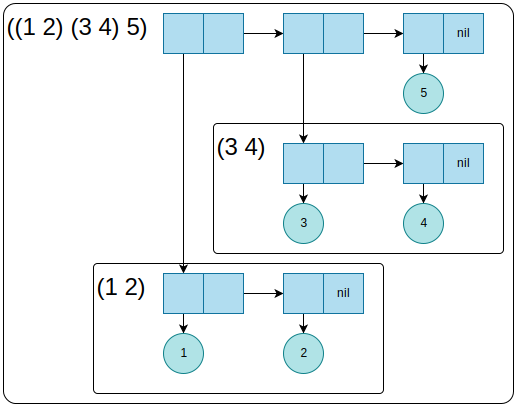

## この章について
この章では、コンスセルのリスト以外の使い方(木、集合、ルックアップテーブル)ついて説明する。

## 13.1 木
コンスセルは木のブランチのような見た目をしている。  
見た目の通り、コンスセルから構成される構造を、木として扱う事もできる。

下図の場合、`(1 2)`, `(3 4)`, `5`という３つの要素を持つリストという見方もできるが、  
`1`, `2`, `3`, `4`, `5`という5つのリーフを持つ木という見方もできる。





ちなみに、最後のコンスセルの`cdr`が`nil`ではなく、何らかのアトムを参照しているリストも作成できる。  
これは、最後のコンスセルがドット対になっているため、**ドットリスト**と呼ばれる。  
最後のコンスセルの`cdr`が`nil`になっているものは、**プロパーリスト(proper list)**と呼ばれる。

```lisp
(1 2 3 4 5) ; プロパーリスト
(1 2 3 4 . 5) ; ドットリスト
```

リスト用の関数と木用の関数は、データ構造に対する「影響範囲」が違う。  
例えば、リストをコピーする`copy-list`関数と、木をコピーする`copy-tree`関数を比較してみる。

### `copy-list`関数
`copy-list`関数は、リスト構造を構成するコンスセルを複製する。(下図)  
複製されたコンスセルが参照するのは、複製元リストにおける対応するコンスセルの参照先と等しい。  
したがって、複製元のリストが参照している要素がアトミックでなかった場合は、複製元と複製先のリスト同士で意図しない影響を与え合うことになる。  
なお、参照先がアトミックであればその要素を変更することはできないため、両者の間に関連はない。



### `copy-tree`関数
一方で、`copy-tree`関数は、木構造を構成するコンスセルを複製する。
つまり、複製先の全てのコンスセルを複製する。ただし、アトムか`nil`のみは共通して参照する。(下図)  
したがって、複製されたコンスセルが複製元のアトミックでない要素を参照することはない。  



*NOTE:* 上図の青丸はアトムで同じ値のアトムは同一のもの。`nil`は全て同一。

### その他の関数
上記以外にも、シーケンス関数(`substitute`, `nsubstitute`, `xxx-if`や`xxx-if-not`の亜種)の木構造バージョンがある。

`subst`関数は、`substitute`関数と同様に、オリジナルの木と同様の構造を持ち、古いアイテムの全てが新しいアイテムに置換された木を返す。

```lisp
(subst new-item old-item tree)

(subst 10 1 '(1 2 (3 2 1) ((1 1) (2 2))))
; (10 2 (3 2 10) ((10 10) (2 2)))
```

`subst-if`関数は、`substitute-if`関数と同様に、古いアイテムを1つ受け取る代わりに1引数関数を受け取る。  
1引数関数は、サブツリーおよびリーフに対してテストする。  
そして、テストが真になったアイテムを、新しいアイテムに置換する。

```lisp
(subst new-item test tree)

(subst-if nil
          #'(lambda (x)
              (and (not (listp x)) (evenp x)))
          '(1 2 (3 2 1) ((1 1) (2 2))))
; (1 NIL (3 NIL 1) ((1 1) (NIL NIL)))
```

`nsubst`, `nsubst-if`, `nsubst-if-not`は、`subst`関数のリサイクルバージョン。  
したがって、これらリサイクルバージョンを使用する場合は、共有された構造を変更するリスクがないことを確認する必要がある。  
また、これらリサイクルバージョンの戻り値は、オリジナルの木と同一(`eq`で真となる)保証がない。  
つまり、オリジナルの木を構成するオブジェクトをそっくりそのまま使用すると言い切れない。  
そのため、「オリジナルバージョンを呼び出したあとに引数に渡したオリジナルの木を参照すれば、変更後の木が手に入る」わけではなく、戻り値の木構造を、保存しておくことが必要となる。

**NOTE:**  
`nsubst`系の関数において、下記のようにアトムを引数に渡された場合には注意が必要となる。  
アトムは変更できないから、この場合の戻り値は、変更前の値と同値だが「同一ではない」オブジェクトになる。

```lisp
(nsubst 'x 'y 'y) ; XをYに置き換えたい(が出来ない)
=> X ; 変更前の値と同値だが「同一ではない」オブジェクトが返る
```
